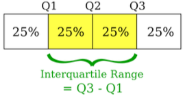
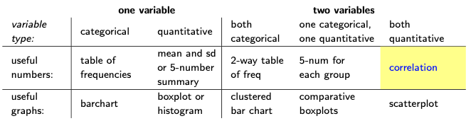

```{r setup, include=FALSE}
knitr::opts_chunk$set(echo = TRUE)

colFmt <- function(x,color="blue") {
  
  outputFormat <- knitr::opts_knit$get("rmarkdown.pandoc.to")
  
  if(outputFormat == 'latex') {
    ret <- paste("\\textcolor{",color,"}{",x,"}",sep="")
  } else if(outputFormat == 'html') {
    ret <- paste("<font color='",color,"'>",x,"</font>",sep="")
  } else {
    ret <- x
  }

  return(ret)
}
```

```{js, echo=FALSE}
$(document).ready(function() {

  $chunks = $('.fold');

  $chunks.each(function () {

    // add button to source code chunks
    if ( $(this).hasClass('s') ) {
      $('pre.r', this).prepend("<div class=\"showopt\">Show Source</div><br style=\"line-height:22px;\"/>");
      $('pre.r', this).children('code').attr('class', 'folded');
    }

    // add button to output chunks
    if ( $(this).hasClass('o') ) {
      $('pre:not(.r)', this).has('code').prepend("<div class=\"showopt\">Show Output</div><br style=\"line-height:22px;\"/>");
      $('pre:not(.r)', this).children('code:not(r)').addClass('folded');

      // add button to plots
      $(this).find('img').wrap('<pre class=\"plot\"></pre>');
      $('pre.plot', this).prepend("<div class=\"showopt\">Show Plot</div><br style=\"line-height:22px;\"/>");
      $('pre.plot', this).children('img').addClass('folded');

    }
  });

  // hide all chunks when document is loaded
  $('.folded').css('display', 'none')

  // function to toggle the visibility
  $('.showopt').click(function() {
    var label = $(this).html();
    if (label.indexOf("Show") >= 0) {
      $(this).html(label.replace("Show", "Hide"));
    } else {
      $(this).html(label.replace("Hide", "Show"));
    }
    $(this).siblings('code, img').slideToggle('fast', 'swing');
  });
});
```

```{css, echo=FALSE}
.showopt {
  background-color: #004c93;
  color: #FFFFFF; 
  width: 100px;
  height: 20px;
  text-align: center;
  vertical-align: middle !important;
  float: right;
  font-family: sans-serif;
  border-radius: 8px;
}

.showopt:hover {
    background-color: #dfe4f2;
    color: #004c93;
}

.textbox {
  padding: 0.5em;
  background: lightgreen;
  color: black;
  border-radius: 10px;
}
.center {
  text-align: center;
}

pre.plot {
  background-color: white !important;
}
```

# The steps involved in a Statistical Analysis

* `r colFmt("What data to collect?")` This depends on what the research question is and who asks it.
* `r colFmt("How to collect data in a clever way?")` Design of experiments, computer simulations.
* `r colFmt("How to organize your data?")` In paper notebooks? files? data bases?
* `r colFmt("How to describe your data?")` File format and size. File content. Statistical descriptive summaries.
* `r colFmt("How to analyse data?")` Relationships, statistical inference

A `r colFmt("dataset", "magenta")` is a collection of data (i.e., numbers, qualifiers, pieces of information) that usually come from actual `r colFmt("observations", "magenta")` collected on `r colFmt("cases", "magenta")`, obtained by sampling a `r colFmt("population", "magenta")`.

Each row corresponds to the observations (values) of a few `r colFmt("variables", "magenta")` (e.g., height or weight) on one given element (case) of that population. 
Each column represents a particular variable.

The data set may comprise data for one or more members, corresponding to the number of rows, and called the `r colFmt("sample size", "magenta")`.


You should \textcolor{magenta}{always} clearly identify the:

* `r colFmt("Population")`: the collection of all individuals or items or objects under consideration in a statistical study, usually determined by what we want to know.
* `r colFmt("Cases")`: the members, objects, units, subjects or individuals from the population, from which information (i.e., data) is collected.
* `r colFmt("IDs")`: the identification code of each case.
* `r colFmt("Sample")`: a subset of the population.
* `r colFmt("Sample size")`, $n$: number of cases/observations in the sample.
* `r colFmt("Variable")`: a characteristic of the cases (measured, collected, recorded or counted).
* `r colFmt("Number of variables")`, $p$: the total number of variable. 

# The *MATH1041 - Statistics for Life and Social Science* Class Survey

First year students taking the MATH1041 course were asked several questions. The answers to those taking the course in Term 1, 2024 were collated into a dataset which we are now loading into R and displaying the first six rows.


<div class="fold o">
```{r echo=TRUE, message=FALSE}
load("data/MATH1041-2024T1.RData")
head(survey.df)
```
</div>

* `r colFmt("Population?")`
* `r colFmt("Cases?")` 
* `r colFmt("IDs?")` 
* `r colFmt("Sample size?")`
* `r colFmt("Number of variables?")`
* `r colFmt("Name of variables?")`


<div class="fold o">
```{r echo=TRUE, message=FALSE}
dim(survey.df) # dimension of the dataset
```
</div>

<div class="fold o">
```{r echo=TRUE, message=FALSE}
nrow(survey.df) # number of rows in the dataset
```
</div>

<div class="fold o">
```{r echo=TRUE, message=FALSE}
ncol(survey.df) # number of columns in the dataset
```
</div>

<div class="fold o">
```{r echo=TRUE, message=FALSE}
names(survey.df) # names of columns in the dataset
```
</div>

# Random Variables

The `r colFmt("type of a variable")` is either `r colFmt("categorical", "magenta")` or `r colFmt("quantitative", "magenta")`.

* A `r colFmt("qualitative", "magenta")` or `r colFmt("categorical", "magenta")` variable places an individual into one of several categories.
* A `r colFmt("quantitative", "magenta")` variable takes numerical values, for which arithmetic operations such as averaging make sense.

We dissociate `r colFmt("two types")` of quantitative random variables:

* `r colFmt("Discrete random variables", "magenta")` can take only distinct, separate values.
* `r colFmt("Continuous random variables", "magenta")` can take any values in some interval (low, high)

**Let's decide what type of variables are in the MATH1041 survey dataset.** If needed type <tt> survey.df$variablename </tt> or simply <tt> variablename </tt> to see the values the variables takes.

<div class="fold o">
```{r echo=TRUE, message=FALSE}
survey.df$Department
```
</div>

<details> <summary> <tt> Department </tt> </summary> `r colFmt("qualitative", "magenta")` </details>
<details> <summary> <tt> gender </tt> </summary> `r colFmt("qualitative", "magenta")` </details>
<details> <summary> <tt> age </tt> </summary> `r colFmt("quantitative, discrete", "magenta")` </details>
<details> <summary> <tt> birth.month </tt> </summary> `r colFmt("qualitative", "magenta")` </details>
<details> <summary> <tt> day.you </tt> </summary> `r colFmt("qualitative", "magenta")` </details>
<details> <summary> <tt> day.bro </tt> </summary> `r colFmt("qualitative", "magenta")` </details>
<details> <summary> <tt> day.mum </tt> </summary> `r colFmt("qualitative", "magenta")` </details>
<details> <summary> <tt> day.dad </tt> </summary> `r colFmt("qualitative", "magenta")` </details>
<details> <summary> <tt> hemisphere </tt> </summary> `r colFmt("qualitative", "magenta")` </details>
<details> <summary> <tt> study.area </tt> </summary> `r colFmt("qualitative", "magenta")` </details>
<details> <summary> <tt> outside.work </tt> </summary> `r colFmt("qualitative", "magenta")` </details>
<details> <summary> <tt> stress </tt> </summary> `r colFmt("qualitative", "magenta")` </details>
<details> <summary> <tt> hours.sleep </tt> </summary> `r colFmt("quanitative, continuous", "magenta")` </details>
<details> <summary> <tt> coffee </tt> </summary> `r colFmt("quantitative, discrete", "magenta")` </details>
<details> <summary> <tt> unsw.satisfaction </tt> </summary> `r colFmt("quantitative, continuous", "magenta")` </details>
<details> <summary> <tt> flu </tt> </summary> `r colFmt("quantitative, discrete", "magenta")` </details>
<details> <summary> <tt> facebook.friends </tt> </summary> `r colFmt("quantitative, continuous", "magenta")` </details>
<details> <summary> <tt> gym </tt> </summary> `r colFmt("quantitative, discrete", "magenta")` </details>
<details> <summary> <tt> fruit.vegetables </tt> </summary> `r colFmt("quantitative, discrete", "magenta")` </details>
<details> <summary> <tt> hair.cost </tt> </summary> `r colFmt("quantitative, continuous", "magenta")` </details>
<details> <summary> <tt> tennis.tv </tt> </summary> `r colFmt("qualitative", "magenta")` </details>
<details> <summary> <tt> survey.finished </tt> </summary> `r colFmt("qualitative", "magenta")` </details>
<details> <summary> <tt> Major </tt> </summary> `r colFmt("qualitative", "magenta")` </details>
<details> <summary> <tt> Sex </tt> </summary> `r colFmt("qualitative", "magenta")` </details>

# Numerical summaries for one variable

## Numerical summaries for a categorical variable

We can summarise one categorical variable using `r colFmt("table of frequencies")` which corresponds to
a `r colFmt("list", "magenta")` of the possible categories (even those not observed) together with their `r colFmt("counts, percent or proportion of cases in each category", "magenta")`.

Consider the survey question *“Did you watch the Australian Open Women Tennis Final (yes/no)?”*, a table of frequencies is produced as follows

<div class="fold o">
```{r echo=TRUE, message=FALSE}
table(tennis.tv)
```
</div>

If we wanted `r colFmt("percentages")`, we would use 

<div class="fold o">
```{r echo=TRUE, message=FALSE}
prop.table(table(tennis.tv)) * 100
```
</div>

and if we wanted both `r colFmt("counts")` and `r colFmt("percentages")` to be displayed

<div class="fold o">
```{r echo=TRUE, message=FALSE}
tbl <- table(tennis.tv)
cbind(tbl, prop.table(tbl) * 100)
```
</div>

## Numerical summaries for a quantitative variable

<!-- `r colFmt("Is it a good idea to compute a table of frequencies or percentages for a quantitative variable? Why? Why not?", "green")` -->

:::: {.textbox data-latex=""}

Is it a good idea to compute a table of frequencies or percentages for a quantitative variable? Why? Why not?
::::

When summarising a **quantitative** variable numerically, we often make sure to include measures of:

* the `r colFmt("location")` (where most of the data are), and 
* the `r colFmt("spread")` (or variability) of the data.

<u> A useful measure of the location is the `r colFmt("mean", "magenta")` </u> which mathematically, if let $\boldsymbol{x}= \{ x_1, \ldots, x_n \}$ represent the $n$ observations (the data points), is calculated as:
$$ \textrm{mean}(\boldsymbol{x})  = \frac{x_1 + \cdots + x_n}{n}.$$
An alternative to the mean is the `r colFmt("median", "magenta")`, it corresponds to the *middle value*. If we sort the observations into $x_{(1)} \leq \cdots \leq x_{(n)}$, the median is computed as
$$\textrm{median}(\boldsymbol{x}) = x_{(n+1)/2}  \textrm{ if } n \textrm{ is odd} \quad \textrm{and} \quad 
\textrm{median}(\boldsymbol{x}) = \frac{1}{2}\left( x_{n/2} + x_{(n+1)/2}\right) \textrm{ if } n \textrm{ is even.}$$

`r colFmt("WARNING", "red")` *The mean can be grossly affected by unusually large (or small) data values that tend to be quite far away from the bulk of the data.*

In R, the `mean()` and `median()` functions, as their name indicate, calculate the mean and median values from a vector of observations. 
<!-- `r colFmt("Use these functions to calculate the mean and median of the UNSW satisfaction score.", "green")` -->

:::: {.textbox data-latex=""}
Use these functions to calculate the mean and median of the UNSW satisfaction score.
::::

<div class="fold s o">
```{r echo=TRUE, message=FALSE}
mean(unsw.satisfaction)
```
</div>

<div class="fold s o">
```{r echo=TRUE, message=FALSE}
median(unsw.satisfaction)
```
</div>

The median splits the data into two groups which contain roughly $50\%$ of the data.

`r colFmt("Quartiles", "magenta")` divide the data into four groups which each contain roughly $25\%$ (a quarter) of the data. `r colFmt("$Q_1$")` and `r colFmt("$Q_3$")` are known as the `r colFmt("first")` and `r colFmt("third")` quantile. `r colFmt("$Q_2$")` is just the median.

<u> A useful measure for spread could be the `r colFmt("Inter-quartiles range (IQR)", "magenta")`</u>.

```{r pressure, echo=FALSE, fig.cap="Quartiles and inter-quartile range", out.width = '33%', fig.align="center"}

```

Other useful measures are the `r colFmt("standard deviation", "magenta")` $\textrm{sd}(\boldsymbol{x})$ and the `r colFmt("variance", "magenta")` $\textrm{var}(\boldsymbol{x}) = \textrm{sd}(\boldsymbol{x})^2$. We voluntarily omit the mathematical expressions, we will use R to calculate them directly.

In R, the `quantile(x=..., probs=...)` function computes the quantiles of a vector given in `x` with probability `probs`. For example, $Q_1$ is found by selecting `probs=0.25`. The standard deviation and variance are respectively computed using the `sd()` and `var()` functions.

<!-- `r colFmt("Use these functions to calculate the IQR, standard deviation and variance of the UNSW satisfaction score.", "green")` -->


:::: {.textbox data-latex=""}
Use these functions to calculate the IQR, standard deviation and variance of the UNSW satisfaction score.
::::

<div class="fold s o">
```{r echo=TRUE, message=FALSE}
diff(quantile(unsw.satisfaction, c(0.25, 0.75)))
```
</div>

<div class="fold s o">
```{r echo=TRUE, message=FALSE}
c( sd(unsw.satisfaction), sd(unsw.satisfaction)^2, var(unsw.satisfaction))
```
</div>

Another useful function is `summary()`, which gives the following 5-number summary

```{r echo=TRUE, message=FALSE}
summary(unsw.satisfaction)
```

# Graphical summaries for one variable

## Graphical summaries for a categorical variable

`r colFmt("**Bar charts**", "magenta")` are used to summarise **categorical** random variables. In R, this is done using the `barplot()` function and below is an example with the `tennis.tv` variable.

<div class="fold o">
```{r echo=TRUE, message=FALSE, out.width="75%", fig.align="center"}
barplot(table(tennis.tv),
        names.arg=c("No", "Yes"),
        main="Did you watch the Australian Open Women Tennis Final?",
        xlab="Answer", ylab="Counts",col="darkred")
```
</div>

The above plot was done in base R, now let's be fancy and use `ggplot`! We require to load the `ggplot2` library (and install it if needed).

```{r echo=TRUE, message=FALSE, out.width="75%", fig.align="center"}
#install.packages("ggplot2")
library(ggplot2)
```

We start by creating a `data.frame` object as follows
<div class="fold o">
```{r echo=TRUE, message=FALSE, out.width="75%", fig.align="center"}
tennis <- data.frame(answer=c("No", "Yes"), count=as.vector(tbl))
tennis
```
</div>


<div class="fold o">
```{r echo=TRUE, emessage=FALSE, out.width="75%", fig.align="center"}
p <- ggplot(data=tennis, aes(x=answer, y=count)) +
            geom_bar(stat="identity", color="blue",fill="steelblue") +
            geom_text(aes(label=count), vjust=1.6, color="white", size=8.5)
p
```
</div>

<!-- `r colFmt("Take the time to play with the arguments to see what each of them does.", "green")` -->

:::: {.textbox data-latex=""}
Take the time to play with the arguments to see what each of them does.
::::

We could improve the plot further by, for example, doing the following

<div class="fold o">
```{r echo=TRUE, message=FALSE, out.width="75%", fig.align="center"}
p + 
  ggtitle("Did you watch the Australian Open Women \n Tennis Final?") +
  xlab("Answer") + 
  ylab("Count") + 
  theme(plot.title = element_text(color="red", size=20, face="bold.italic"),
        axis.text = element_text(size=16),
        axis.title.x = element_text(color="blue", size=20, face="bold"),
        axis.title.y = element_text(color="#993333", size=20, face="bold"))
```
</div>

## Graphical summaries for a quantitative variable

`r colFmt("**Boxplots**", "magenta")` and `r colFmt("**Histograms**", "magenta")` are used to summarise **quantitative** random variables. In R, the corresponding functions are `boxplot()` and `hist()`. Below is an example applied to the UNSW satisfaction score, using the `ggplot2` library.  

<div class="fold o">
```{r echo=TRUE, message=FALSE, out.width="65%", fig.align="center"}
sat <- data.frame(satisfaction = unsw.satisfaction)
p2 <- ggplot(data=sat, aes(x="", y=satisfaction)) +
             geom_boxplot(fill = "white", colour = "#3366FF",
                          outlier.colour = "red", outlier.shape = 1) +
             ylab("Score") + 
             xlab("") + 
             theme_bw()
p2
```
</div>

`r colFmt("Note:", "red")` the length of the whiskers is by default 1.5 times IQR, the argument `coef` in `geom_boxplot()` controls that value.

<!-- `r colFmt("Once again, take the time to play with the arguments to see what each of them does.", "green")` -->

:::: {.textbox data-latex=""}
Once again, take the time to play with the arguments to see what each of them does.
::::

We could super-impose the data points to the plot

<div class="fold o">
```{r eval=TRUE, message=FALSE, out.width="65%", fig.align="center"}
p2 + geom_jitter(width = 0.2) + 
     theme(axis.text = element_text(size=16),
           axis.title.y = element_text(color="#993333", size=20, face="bold"))
```
</div>

... and now plotting a histogram

<div class="fold o">
```{r eval=TRUE, message=FALSE, out.width="65%", fig.align="center",warning=FALSE}
p3 <- ggplot(data=sat, aes(satisfaction)) +
             geom_histogram(fill = "#69b3a2", colour = "purple", bins=10, linewidth=2) +
             xlab("Score") + 
             ylab("Count") + 
             theme_classic() +
             theme(axis.text = element_text(size=16),
                   axis.title.y = element_text(color="magenta", size=20, face="bold"))
p3
```
</div>

# Numerical summaries for two variables

## Numerical summaries for two categorical variables

In this case we use a `r colFmt("**2-way table of frequencies**", "magenta")`, which we compute using the `table()` function, like when we add only one variable. Let's consider the variables `sex` and `stress` which we have agreed to be categorical.

<div class="fold o">
```{r echo=TRUE, message=FALSE}
table(sex, stress)
```
</div>

Adding `r colFmt("proportions")`:

<div class="fold o">
```{r echo=TRUE, message=FALSE}
tbl2 <- table(sex, stress)
round(prop.table(tbl2, margin =2),3) # for column
round(prop.table(tbl2, margin =1),3) # for row
```
</div>

For fancier table see e.g., `tabyl()`.

## Numerical summaries for one categorical and one quantitative variable

Here we compute a `r colFmt("**5-number summary for each group/category**", "magenta")`.

<div class="fold o">
```{r echo=TRUE, message=FALSE}
summary(hair.cost[sex=="Female"])
summary(hair.cost[sex=="Male"])
```
</div>

# Graphical summaries for two variables

## Graphical summaries for two categorical variables

When we have two categorical variables, we use a `r colFmt("**clustered bar chart**","magenta")`. The `ggplot2` library makes this kind of plot easy, and in this case we use the `geom_bar()` function.

Again, we start by creating a `data.frame` object.
<div class="fold o">
```{r eval=TRUE, message=FALSE, out.width="65%", fig.align="center"}
SS <- data.frame(stress=rep(colnames(tbl2), each=2), 
                 sex = c(rep(rownames(tbl2), 5)),
                 count=as.vector(tbl2))
SS
```
</div>
and then proceed to plot
<div class="fold o">
```{r eval=TRUE, message=FALSE, out.width="65%", fig.align="center"}
p4 <- ggplot(data=SS, aes(x=stress, y=count, fill=sex)) +
             geom_bar(stat="identity", position="dodge") +
             ggtitle("Are you stressed?") +
             ylab("Count") + 
             xlab("Stress") + 
             theme_classic() +
             theme(axis.text = element_text(size=12),
                   axis.title = element_text(color="magenta", size=20))
p4
```
</div>

## Graphical summaries for one categorical and one quantitative variable

In that case, we use `r colFmt("**comparative boxplots**","magenta")`. Following the previous examples, it is fairly straightforward to do such plots with `ggplot2`.

We create a `data.frame` object ...

<div class="fold o">
```{r eval=TRUE}
SH <- data.frame(sex=sex, hair.cost=hair.cost)
SH
```
</div>

... and plot!

<div class="fold o">
```{r eval=TRUE, message=FALSE, out.width="65%", fig.align="center"}
p5 <- ggplot(data=SH, aes(x=sex, y=hair.cost)) +
             geom_boxplot() +
             ggtitle("How much do you spend on a hair cut?") +
             ylab("Amount($)") + 
             xlab("Sex") + 
             theme_classic() +
             theme(axis.text = element_text(size=16),
                   axis.title = element_text(color="magenta", size=20))
p5
```
</div>

**Do you see anything funny/crazy??**

Let's re-do this plot and remove the observation with the largest cost for a haircut.

<div class="fold o">
```{r echo=TRUE, message=FALSE, out.width="65%", fig.align="center"}
p5 <- ggplot(data=SH[-which.max(hair.cost),], aes(x=sex, y=hair.cost, fill=sex)) +
             geom_boxplot() +
             ggtitle("How much do you spend on a hair cut?") +
             ylab("Amount($)") + 
             xlab("Sex") + 
             scale_fill_brewer(palette="Dark2") +
             theme_classic() +
             theme(axis.text = element_text(size=16),
                   axis.title = element_text(color="magenta", size=20))
p5 + stat_summary(fun=mean, geom="point", shape=23, size=4) # adding means
```
</div>

## Graphical summaries with two quantitative variables

The easiest way to display **two quantitative random variables** is via a `r colFmt("**scatterplot**", "magenta")`. Below we use the `geomm_point()` function to plot the average number of hours of sleep per night (`hours.slept`) as a function of age (`age`). 

<div class="fold o">
```{r}
AH <- data.frame(age=age, hours=hours.sleep)
head(AH, 10)
```
</div>

<div class="fold o">
```{r eval=TRUE, message=FALSE, warning=FALSE, out.width="65%", fig.align="center"}
p6 <- ggplot(data=AH, aes(x=age, y=hours.sleep)) +
             ggtitle("Hours slept as function of age") +
             ylab("Hours slept") + 
             xlab("Age") + 
             theme(axis.text = element_text(size=16),
                   axis.title = element_text(color="magenta", size=20))
p6 + geom_point(shape = 21, colour = "pink", fill = "black", size = 3, stroke = 3)
```
</div>

<!-- `r colFmt("Once again, take the time to play with the arguments to see what each of them does.", "green")` -->

:::: {.textbox data-latex=""}
Once again, take the time to play with the arguments to see what each of them does.
::::


We can change the type of point in the scatterplot **as a function of a third, categorical, variable**.

<div class="fold o">
```{r}
AH$sex <- sex
head(AH,10)
```
</div>

<div class="fold o">
```{r eval=TRUE, message=FALSE, warning=FALSE, out.width="65%", fig.align="center"}
p6 + geom_jitter(aes(shape=factor(sex), colour = factor(sex), size=2)) +
     scale_x_continuous(limits = c(18, 45)) +
     scale_y_continuous(limits = c(1, 12)) +
     scale_colour_discrete("Sex") +
     guides(size = "none", shape = "none") +
     theme(legend.text = element_text(size=16))
```
</div>

## Numerical summaries with two quantitative variables

`r colFmt("**Correlation**","magenta")` is a special form of dependence (association) **between two quantitative variables**. The correlation coefficient is a number that measures the association between two quantities, indicating  the `r colFmt("strength")` and the `r colFmt("direction")` of the `r colFmt("linear statistical relationship", "magenta")` between the variables.

We denote the (Pearson) Coefficient of correlation by $r$ and for any data set
$$ -1 \leq r \leq 1.$$
It is interpreted as follows:

* $r$ close to 1 $\Leftrightarrow$ strong `r colFmt("positive", "magenta")` linear relationship.
* $r$ close to -1 $\Leftrightarrow$ strong `r colFmt("negative", "magenta")` linear relationship.
* $r$ close to 0 $\Leftrightarrow$ weak or non-existent linear relationship.


```{r echo=FALSE, fig.cap="Examples of correlation between two variables", out.width = '33%', fig.align="center", fig.show='hold'}
knitr::include_graphics(c("img/CorPos.png","img/CorNeg.png")) 
```

In R, the correlation between two variables, say `x` and `y` is computed using `cor(x,y)`. If the variables are stored in the same object (a `matrix` or a `data.frame`), then providing the column indicator is sufficient. E.g., `cor(mat[,1:2])`.

<!-- `r colFmt("Look at the scatterplot of the average number of hours of sleep per night and age, what is your guess for the correlation between these two variables? Use R to check your intuition.", "green")` -->

:::: {.textbox data-latex=""}
Look at the scatterplot of the average number of hours of sleep per night and age, what is your guess for the correlation between these two variables? Use R to check your intuition.
::::


<div class="fold s o">
```{r echo=TRUE, message=FALSE}
cor(AH[,1:2]) # Same as cor(AH[,1], AH[,1]) . Both produces NA!!!
cor(na.omit(AH)[,1:2])
```
</div>


# Summary of the different numerical/graphical summaries

The table below provides a summary of which tool to use when providing numerical and/or graphical summaries of one or more variables

```{r echo=FALSE, fig.cap="Summary of summaries!", out.width = '80%', fig.align="center", fig.show='hold'}
 
```

# TL;DR - Code

<details>
  <summary>Toggle to see all of the code</summary>
  ```{r cars, eval = F}
  load("data/MATH1041-2024T1.RData")
head(survey.df)
dim(survey.df) # dimension of the dataset
nrow(survey.df) # number of rows in the dataset
nrow(survey.df) # number of rows in the dataset
survey.df$Department 
table(tennis.tv)
prop.table(table(tennis.tv)) * 100 #percentages
tbl <- table(tennis.tv)
cbind(tbl, prop.table(tbl) * 100)
# Numerical summaries for a quantitative variable
mean(unsw.satisfaction)
median(unsw.satisfaction)
diff(quantile(unsw.satisfaction, c(0.25, 0.75)))
c( sd(unsw.satisfaction), sd(unsw.satisfaction)^2, var(unsw.satisfaction))
c( sd(unsw.satisfaction), sd(unsw.satisfaction)^2, var(unsw.satisfaction))
# Graphical summaries
barplot(table(tennis.tv),
        names.arg=c("No", "Yes"),
        main="Did you watch the Australian Open Women Tennis Final?",
        xlab="Answer", ylab="Counts",col="darkred")
library(ggplot2)
tennis <- data.frame(answer=c("No", "Yes"), count=as.vector(tbl))
p <- ggplot(data=tennis, aes(x=answer, y=count)) +
            geom_bar(stat="identity", color="blue",fill="steelblue") +
            geom_text(aes(label=count), vjust=1.6, color="white", size=8.5)
p + 
  ggtitle("Did you watch the Australian Open Women \n Tennis Final?") +
  xlab("Answer") + 
  ylab("Count") + 
  theme(plot.title = element_text(color="red", size=20, face="bold.italic"),
        axis.text = element_text(size=16),
        axis.title.x = element_text(color="blue", size=20, face="bold"),
        axis.title.y = element_text(color="#993333", size=20, face="bold"))
        
sat <- data.frame(satisfaction = unsw.satisfaction)
p2 <- ggplot(data=sat, aes(x="", y=satisfaction)) +
             geom_boxplot(fill = "white", colour = "#3366FF",
                          outlier.colour = "red", outlier.shape = 1) +
             ylab("Score") + 
             xlab("") + 
             theme_bw()
p2 + geom_jitter(width = 0.2) + 
     theme(axis.text = element_text(size=16),
           axis.title.y = element_text(color="#993333", size=20, face="bold"))
           p2 + geom_jitter(width = 0.2) + 
     theme(axis.text = element_text(size=16),
           axis.title.y = element_text(color="#993333", size=20, face="bold"))
# Numerical summaries for two categorical variables
table(sex, stress)
tbl2 <- table(sex, stress)
round(prop.table(tbl2, margin =2),3) # for column
round(prop.table(tbl2, margin =1),3) # for row
summary(hair.cost[sex=="Female"])
summary(hair.cost[sex=="Female"])
# Graphical summaries for two categorical variables
SS <- data.frame(stress=rep(colnames(tbl2), each=2), 
                 sex = c(rep(rownames(tbl2), 5)),
                 count=as.vector(tbl2))
                 
p4 <- ggplot(data=SS, aes(x=stress, y=count, fill=sex)) +
             geom_bar(stat="identity", position="dodge") +
             ggtitle("Are you stressed?") +
             ylab("Count") + 
             xlab("Stress") + 
             theme_classic() +
             theme(axis.text = element_text(size=12),
                   axis.title = element_text(color="magenta", size=20))

SH <- data.frame(sex=sex, hair.cost=hair.cost)   

p5 <- ggplot(data=SH, aes(x=sex, y=hair.cost)) +
             geom_boxplot() +
             ggtitle("How much do you spend on a hair cut?") +
             ylab("Amount($)") + 
             xlab("Sex") + 
             theme_classic() +
             theme(axis.text = element_text(size=16),
                   axis.title = element_text(color="magenta", size=20))
                   
p5 <- ggplot(data=SH[-which.max(hair.cost),], aes(x=sex, y=hair.cost, fill=sex)) +
             geom_boxplot() +
             ggtitle("How much do you spend on a hair cut?") +
             ylab("Amount($)") + 
             xlab("Sex") + 
             scale_fill_brewer(palette="Dark2") +
             theme_classic() +
             theme(axis.text = element_text(size=16),
                   axis.title = element_text(color="magenta", size=20))
p5 + stat_summary(fun=mean, geom="point", shape=23, size=4) # adding means

AH <- data.frame(age=age, hours=hours.sleep)
head(AH, 10)
p6 <- ggplot(data=AH, aes(x=age, y=hours.sleep)) +
             ggtitle("Hours slept as function of age") +
             ylab("Hours slept") + 
             xlab("Age") + 
             theme(axis.text = element_text(size=16),
                   axis.title = element_text(color="magenta", size=20))
p6 + geom_point(shape = 21, colour = "pink", fill = "black", size = 3, stroke = 3)

AH$sex <- sex
head(AH,10)

p6 + geom_jitter(aes(shape=factor(sex), colour = factor(sex), size=2)) +
     scale_x_continuous(limits = c(18, 45)) +
     scale_y_continuous(limits = c(1, 12)) +
     scale_colour_discrete("Sex") +
     guides(size = "none", shape = "none") +
     theme(legend.text = element_text(size=16))
     
  # Numerical summaries with two quantitative variables  
cor(AH[,1:2]) # Same as cor(AH[,1], AH[,1]) . Both produces NA!!!
cor(na.omit(AH)[,1:2])
  ```
</details>
